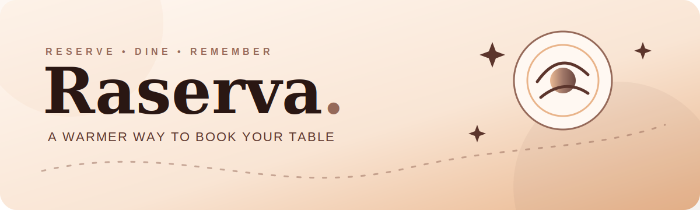

<p align="center">
  
</p>

<p align="center">
  
  
  
  
</p>

# Raserva Web

Frontend **Raserva**, aplikasi reservasi restoran dengan pengalaman booking
yang hangat dan sederhana. Customer dapat memilih meja, menambahkan pre-order,
membayar deposit melalui Midtrans, lalu memantau status reservasi. Admin
mengelola operasional restoran melalui dashboard terpisah.

## Highlights

- Landing page restoran dengan katalog menu dan quick reservation.
- Alur reservasi bertahap: meja, pre-order, ringkasan, pembayaran.
- Login dan register dengan redirect dashboard berdasarkan role.
- Customer dashboard untuk booking, profil, dan review.
- Admin dashboard untuk reservasi, menu, meja, order, review, dan jadwal.
- Route guard menggunakan `proxy.ts` untuk membatasi dashboard sesuai role.
- Responsive UI dengan palet warna Raserva:
  `#E9B48A`, `#956959`, `#5C352C`, dan `#2A1713`.

## Stack

- Next.js 16 App Router
- React 19 dan TypeScript
- React Icons untuk ikon antarmuka
- CSS responsif dengan Tailwind CSS PostCSS
- Raserva Express API sebagai backend

## Menjalankan Lokal

Pastikan API berjalan di port `4100`, lalu:

```bash
cp .env.example .env.local
npm install
npm run dev
```

Buka [http://localhost:3000](http://localhost:3000).

## Environment Variable

```env
NEXT_PUBLIC_API_URL="http://localhost:4100/api"
```

Saat deploy, ganti nilainya dengan endpoint API production:

```env
NEXT_PUBLIC_API_URL="https://raserva-api.vercel.app/api"
```

## Halaman Publik

| Route | Kegunaan |
| --- | --- |
| `/` | Landing page dan quick booking |
| `/about` | Tentang restoran |
| `/contact` | Informasi kontak |
| `/auth/login` | Login customer dan admin |
| `/auth/register` | Registrasi customer |

## Dashboard Customer

| Route | Kegunaan |
| --- | --- |
| `/dashboard/customer` | Ringkasan akun customer |
| `/dashboard/customer/menu` | Daftar makanan dan minuman |
| `/dashboard/customer/menu/[id]` | Detail menu |
| `/dashboard/customer/reservation` | Alur reservasi lengkap |
| `/dashboard/customer/bookings` | Daftar reservasi |
| `/dashboard/customer/bookings/[id]` | Detail reservasi |
| `/dashboard/customer/profile` | Profil customer |
| `/dashboard/customer/reviews` | Review restoran |

## Dashboard Admin

| Route | Kegunaan |
| --- | --- |
| `/dashboard/admin` | Ringkasan operasional |
| `/dashboard/admin/reservations` | Kelola reservasi |
| `/dashboard/admin/menu` | CRUD menu |
| `/dashboard/admin/tables` | Kelola meja |
| `/dashboard/admin/orders` | Status order makanan |
| `/dashboard/admin/reviews` | Moderasi review |
| `/dashboard/admin/settings/schedule` | Jadwal time slot |

## Struktur Ringkas

```text
app/
|-- (public)/             # Landing, about, dan contact
|-- auth/                 # Login dan register
|-- dashboard/
|   |-- admin/            # Halaman admin
|   `-- customer/         # Katalog, booking flow, dan akun customer
components/               # Komponen UI bersama
lib/                      # Data contoh dan session helper
proxy.ts                  # Role-aware route protection
```

## Scripts

| Command | Kegunaan |
| --- | --- |
| `npm run dev` | Jalankan development server |
| `npm run lint` | Periksa kualitas kode |
| `npm run build` | Build production |
| `npm run start` | Jalankan hasil build |

## Deployment

Deploy folder ini sebagai Vercel Project dengan Root Directory `web`.
Instruksi lengkap tersedia di [panduan deployment](../DEPLOYMENT.md).
